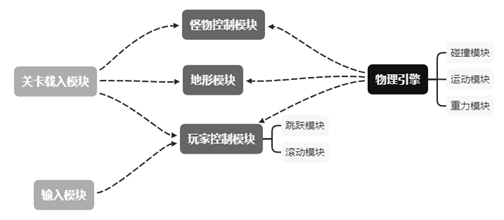

[toc]

# 计算机程序设计课程实践项目报告

# Roll a Ball C#版

完成人:

- PB20000155	徐笑阳
- PB20000158	曾彬城
- PB20061360	邱慕凡

完成时间：2020年12月30日

## 摘要

本项目是基于Unity开发的2D横版收集分数小游戏。游戏性能高，不卡顿，资源占用少，界面简约，游戏方式经典，但是游戏内容综合了其他2D横版过关游戏的设计与3位开发人员独特的创意。本游戏界面完全图形化，综合了经典素材与现代素材，给玩家视觉与听觉上的盛宴。本游戏的关卡设计富有特色，难度设计合理，但给玩家脑洞大开的体验。本游戏更体现了游戏严谨的逻辑与经典的计算思维，锻炼团队协作能力，是一个优秀的游戏与程序设计作品。

##  关键词

程序设计、小游戏、C#、Unity、合作开发、横版收集

## 1. 项目概述

### 1.1 项目特点

本游戏是2D横版积分游戏。受到2D横版过关游戏《超级马里奥》和《猫里奥》的启发，开发组结合了《超级马里奥》的操作方式与《猫里奥》富有特色的关卡设计，继承《正常的大冒险》的游戏风格，加以开发者对游戏方式与内容的创新，设计出这个以获得高分为目标的游戏。本游戏基于Unity开发环境，可以在Windows与MacOS上运行，游戏操作简单方便，界面丰富多彩，性能与稳定性极佳，可以激发玩家与开发者对计算机学习的兴趣，提升玩家的手脑协调的能力，是一个非常有趣的小游戏。

### 1.2 项目设计

在开发的初期，开发组对编程枯燥的界面没有感到太大的兴趣，但是Unity独具一格的可视化编程方法大大提升开发组的兴趣。

它基于C#的面向对象编程理念也可以帮助开发组管理代码，扩充编程思维，从而更深入地了解计算机，也能方便开发组实现自己的想法， 更高效地开发出更高质量的游戏。

为保证游戏质量，本游戏专门有一位开发人员不参与游戏性的开发，只负责测试游戏与提供游戏所需素材。同时开发组使用了Photoshop绘制了素材与概念稿，使游戏UI明了、简洁。

### 1.2.1 功能分析

- 本游戏是单机游戏，游戏目标是玩家控制小球绕过障碍物，利用机关、躲避怪物、获得高分

- 本游戏有部分素材从Unity的Asset Store里选取恰当的素材并且进行适当加工，剩余素材为原创素材。这些素材使界面简洁清晰，一目了然

- 本游戏的关卡设计合理，有专门的关卡设计师负责

- 本游戏允许二段跳，提升了玩家的可操作空间与游戏趣味


### 1.2.2 性能分析

- 游戏画面流畅，性能优良，无卡顿

- 游戏关卡设计富有趣味，锻炼玩家心理素质，耐玩性极高

- 本游戏代码开源，不盈利，旨在为玩家与开发者提供一个学习平台

## 2 系统设计

### 2.1 系统总体设计

小游戏有简单的菜单选项，用来选择相应的功能，包括：

- 开始游戏
- 游戏操作说明
- 游戏的规则说明
- 退出游戏

在游戏中应体现的功能包括：

- 游戏的得分纪录和得分的实时更新
- 游戏基本操作
  - 滚动
  - 二段跳
- 游戏的基本规则
  - 与怪物的互动
  - 与机关的互动
- 退出游戏

该项目包含关卡载入、输入、怪物控制、地形、玩家控制、模块与物理引擎。其关系图如下：



其中输入模块控制键盘与鼠标的输入，关卡载入模块将数据库中的关卡数据读入程序，玩家控制模块控制玩家可进行的操作，包括滚动与跳跃两种操作，地形模块控制玩家与地形障碍物的互动，怪物控制模块控制怪物与玩家的互动，而物理引擎是整个游戏的基石，它可以控制碰撞、运动与重力，使游戏看起来更自然，更符合玩家的直观感受，优化游戏体验。

### 2.2 主要数据结构

#### 2.2.1 人物

```C#
public class Player : MonoBehaviour
{
    [Header("辅助参数")]
    public Rigidbody2D rb;		//角色的刚体, 方便进行物理判断
    public SpriteRenderer sr;	//角色的渲染材质, 方便之后切换
    public LayerMask ground;	//地面检测
    [Header("球切换的参数")]
    public List<float> masses;	//不同球的质量
    public List<float> gravity;	//不同球的重力
    public List<float> grab;	//不同球的阻力
    public List<Sprite> sprites;//不同球的材质
    [Header("跳跃参数")]
    public float moveForce;		//水平移动的速度
    public float jumpForce;		//跳跃的速度
    public float jumpHeld;		//长按带来的跳跃高度加成
    public float jumpDuration;	//长按跳跃的判定时间
    public float jumpTime;		//辅助参数
    public int jumpCount;		//可以几段跳
    private int initCount;
    public Transform groundCheck;//地面监测点的坐标
    public float dis;
    [Header("状态参数")]
    public bool isJumpPressed;	//跳跃键是否被按下
    public bool isJumping;		//是否在空中
    public bool isJumpHeld;		//跳跃键是否持续按住
    public bool isGround;		//是否在地面上
    [Header("动画参数")]
    public Animator anim;		//动画装填控制
    [Header("音乐参数")]
    public AudioSource audioSource;	//音效控制

    ...
}
```

#### 2.2.2 怪物

父类:

```c#
public class Enemy : MonoBehaviour
{
    public Animator animator;		//死亡动画
    public AudioSource deathAudio;	//死亡音效
	...
}

```

子类:

```c#
public class AutoMoveFrog : Enemy
{
    public float velocity;		//怪物移动的速度
    public Rigidbody2D rb;		//处理判断时间的刚体
    public float rayDis;		//射线的长度
    ...
}
```

#### 2.2.3 收集物生成器

```c#
public class CherryGenerate : MonoBehaviour
{
    public float deltaTime;				//生成的间隔时间
    public GameObject rightdownObject;	//生成的坐标方位
    public GameObject leftupObject;
    private Vector3 rightdown;		
    private Vector3 leftup;
    private float regenerateTime;	//重新生成的时间
    public int generateNum;			//一次性生成的个数
    public int generateLim;			//生成的个数限制
    public GameObject cherryPrefab;	//生成的对象
    public string countName;		//本地存储的生成个数的键值
    ...
}
```

#### 2.2.4 各类机关

```C#
public class AddScore : MonoBehaviour	//添加得分
{
    private int bestScore;				//最高得分
    private string levelName;			//关卡名字
    public TextMeshProUGUI scoreGUI;	//GUI控件
    public TextMeshProUGUI bestScoreGUI;
    public string countName;			//收集物的名称
    ...
}


public class FallWhenTrigger : MonoBehaviour	//掉落下来袭击玩家的机关
{
    public float upLimit = 5.0f;		//循环移动的上下边界
    public float downLimit = -10f;		
    public float fallVelocity = 2.0f;	//降落速度
    public float velocity = 0f;			//初始速度
    ...
}

public class MoveUpThanPlayer : MonoBehaviour	//让玩家踩不到的机关
{
    public GameObject player;		//玩家检测
    public LayerMask playerLayer;	//碰撞层
    public float yOffset;			//和玩家的距离
    ...
}

public class SimpleAutoMove : MonoBehaviour	//怪物自动移动的模块
{
    public float velocity = 2.0f;	//自动移动的速度
    public float rayDis = 0.7f;		//射线检测的距离
    public LayerMask groundLayer;	//检测的层
	...
}

public class SummonAFrogAfterPushed : MonoBehaviour	//触发之后召唤怪物
{
    public GameObject player;						//玩家对象
    public GameObject enemy;						//要召唤的怪物对象
}

```

### 2.3 模块设计

#### 2.3.1 菜单模块

该模块通过按钮来进入不同的场景，具体规则如下：

- Play按钮，用来进入游戏页面
- Help按钮，用来进入帮助界面
- Quit按钮，用来退出游戏

#### 2.3.2 判定模块

该模块主要功能是逻辑判断功能模块，判断的内容主要是：

- 游戏是否结束：判断游戏是否结束，如果玩家被怪物杀死或者触碰致死的障碍物。
- 是否触发机关：判断机关是否被触发，如果玩家或者怪物碰到机关触发器，那么机关就会被触发。
- 角色是否碰到障碍物：判断玩家或者怪物是否碰到障碍物，如果碰到则触发反弹。如果玩家下方没有障碍物则玩家受到向下的重力加速度。
- 怪物是否被杀死：判断玩家是否从上方击中可被杀死的怪物从而判断该怪物是否会被杀死。
- 判断是否得分：通过判断小球是否击中可得分物体来判断玩家是否得分。   

#### 2.3.3 逻辑模块

该模块是游戏的主要模块，游戏需要有逻辑规则来保证趣味性的，该模块主要包括的功能函数有：

- 保证左右键的作用，移动、加速与变换。
- 保证分数的更新和相应游戏模式的变化。
- 保证游戏规则。
- 保证怪物在玩家可到达的地方并不断移动。
- 保证物体与物体之间不穿模。
- 判断玩家是否可以进行跳跃或二段跳。
- 定时清理游戏中过多的可收集物品与怪物。
- 定时自动生成一定数量的怪物和可收集物品。

#### 2.3.4 动画模块

该模块是游戏的动画模块，游戏需要动画的润色才能达到更好的视觉效果，给玩家更好的体验：

- 怪物动画：为怪物的移动与死亡添加动画，为玩家提供即时的视觉反馈。
- 玩家动画：为玩家的死亡添加动画，轻快的画风也可以降低玩家心中的沮丧情绪。

#### 2.3.5 音效模块

该模块是游戏的声音模块，声音不仅可以渲染游戏的气氛，也可以给玩家提供信息反馈：

- 背景音乐：为游戏添加轻快的背景音乐，给玩家游戏的快节奏体验，也能增加玩家心中的喜悦。
- 怪物击杀音效：为怪物的死亡添加声音，给玩家提供反馈的同时也能宣泄玩家对怪物的恨意。
- 玩家死亡音效：短暂的死亡音效，告诉玩家游戏结束了。

### 2.4 开发语言和开发工具

本项目采用C#语言作为开发语言，C#语言的主要特点如下： 

- 语言简洁、紧凑，使用方便
- 内置库强大，具有现代语言的各种数据结构。
- 具有结构化的语句
- 便于进行面向对象的程序设计，方便了游戏的实现与多人合作
- 生成的目标代码质量高，程序执行效率高
- 拥有垃圾回收机制，不需要担心内存泄漏问题
- 用C#语言编写的程序可移植性比较好，基本上不做任何修改就能运用于各种操作系统中
- 是Unity指定的编写语言

本项目采用Unity作为开发工具, Unity的主要特点如下:

- 内置强大的物理引擎, 如碰撞检测, 重力效果等
- 可视化的对象编辑器
- 简洁的GUI框架
- 对动画和音效的完善的支持

## 3 系统测试

### 3.1 系统运行

- 游戏帮助：

  本游戏的开始界面有3个按钮：Play, Help, Quit。Play可以开始新的游戏，Help可以进入帮助界面，Quit可以退出应用。本游戏的游戏目标是在死亡前尽可能获得多的分数。在游戏中，你的角色是一个球。你可以按左(右)方向键来向左(右)移动或者按空格键跳跃，但是不能越过障碍物。本游戏允许二段跳。游戏中的非玩家控制角色包括樱桃和怪物。吃掉樱桃可以获得分数，从上方接触青蛙怪物可以杀死它，但是从侧面或者下方接触青蛙怪物，或者以任何形式接触其他怪物会被怪物杀死。

- 测试评价：

  在项目完成之时，本游戏的操作手感已比最初版本好很多，开始时的bug与不合理之处已基本被修复。得益于Unity优秀的性能，本游戏在配置较差的现代机器上亦可做到丝毫无卡顿，游戏帧数高，视觉效果极佳。

### 3.2 系统测试

本程序的资源占用

CPU占用率：3%-7% (Intel® Core™ i7 4700MQ单核)

内存：80M-95M

GPU：30%-40% (NVIDIA GeForce GT 730M) 

经过了大量的系统测试，我们做出了如下修改：

- 修复了天花板可以刷新小球的二段跳
- 修复了小球落地时立即起跳可以跳得过高
- 在空中按左右键原改变加速度，但是这严重加大了操作难度。故将按左右键改为改变速度。
- 综合游戏难度与创新性的考虑，将原本的过关游戏改为在有限的空间内收集分数的游戏。
- 为了增加游戏难度，移除了石球与弹性球
- 增大了怪物的体积，大幅度增加了玩家杀死怪物的难度
- 增加了帮助界面，为帮助新玩家更快适应这个游戏
- 修改了怪物的初始速度方向，这很大程度上优化了任意地图上的游戏体验

## 4 结论和体会

本游戏开发组实现了以上各章节的功能，已经基本完成了Roll a Ball游戏的开发，Roll a Ball是一个趣味性和操作性很强的游戏。本游戏代码结构清晰，便于合作开发。界面友好，基本操作简单，操作空间极大。综合了玩家的视听感官，特制的UI设计与完善的帮助界面使得本游戏对新玩家极其友好。由于时间关系，许多同学们的建议未能实现，但是这并不妨碍本游戏是一个创新性极高、体验极佳、系统完备的游戏。

开发组在开发过程中学习到了很多。

- 团队协作的重要性：本次作业的团队分工较为合理，一位同学负责主要代码，一位同学负责关卡设计，一位同学负责素材收集以及测试。这三项工作绝非易事，工作难度相当，工作方向也完全不同。这样的分工大大提高了我们的效率。这次制作也有一些工作分配不合理的地方。比如一位组员制作的许多素材与另一位组员的冲突了，导致其中有大量的工作冗余。不过这更加深了我们对团队协作重要性的理解。
- 横版游戏开发手感打磨的重要性：虽然我们有强大的Unity引擎支撑，但是我们遇到的bug数量如此之多，开始时操作不方便之处与想象中差距那么大。
  - 2D横版游戏看似简单，但是其中的碰撞检测对延时要求非常短，碰撞检测的精确程度要非常高，不然违背玩家直觉的现象会在很大程度上败坏游戏体验。之后我们采用了牺牲性能增加判定次数的方式来解决穿墙问题。
  - 设计师不得不为了游戏性在物理常识方面做出妥协。一开始采用的是施加力改变加速度的方式来完成球的运动， 但是测试过后发现这样的运动手感较差，运动极其不灵活，于是改成了改变速度的运动方式。
  - 跳跃看似只需要简单的检测空格键即可，但是一开始为了实现区分地面和天花板的碰撞、与怪物碰撞之后还能弹起的效果，花费了我们不少精力。同时，在我们改用射线进行跳跃检测判定之后，如何更好地打磨手感又成了新的问题。带着这个我们，我们了解了横版游戏开发中相关的知识，了解到了土狼跳跃和延迟输入，也明白了横版游戏中的扛鼎之作，蔚蓝、空洞骑士的成功绝非偶然。蔚蓝的五千行人物代码带给了我们难以想象的震撼，让我们见证了游戏开发中精益求精、不断打磨、追求卓越的精神。
- 游戏设计的挑战性：2D横版游戏的关卡设计难度是非常大的。曾经我们玩《超级马里奥》与《猫里奥》的时候对其中部分关卡设计的不合理之处有过许多不满，但是最初的2D横版过关模式的关卡设计就给设计师带来了许多困扰，最后不得不通过改变游戏形式来降低游戏设计难度。因此我们也更加深刻的理解了，像黑魂、蔚蓝，他们的颇具难度而又不使人挫败的关卡设计是何等的匠心独具，其中又蕴含了开发者怎样的心血。
- 素材收集的难度：经过了这次游戏制作，负责素材收集的同学深刻理解到设计一个直观简约的UI是一项非常困难的工作。网上的素材是海量的，但是真正适合我们游戏的素材却凤毛麟角。在大量的搜索工作后，我们不得不在Photoshop中独立绘制属于自己的游戏素材。经过了大量的工作，我们也仅仅制作了主界面、帮助界面与小部分游戏素材。同时，本游戏中的音频和动画也来自于网上素材，自行制作时间成本将难以估量。

这次的课程实践让我们学到了更多团队协作的技能，也让我们明白了前人的工作极其不容易，我们应当用学习与欣赏的眼光看待那些极其优秀的作品。总而言之，这次实践让我们获得了如此多的课本上学不到的宝贵经验。